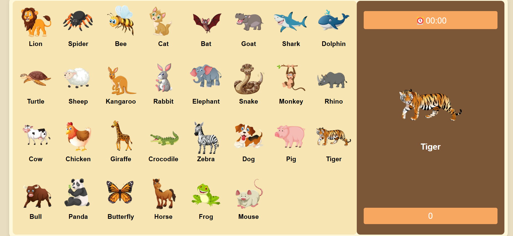

# 🐾 Animal Matching Game

Welcome to the **Animal Matching Game**, a fun and interactive way to challenge your memory and recognition skills with cute animal pictures! Test how quickly you can match the correct animals and rack up your score.

<div align="center">
  <h2 align="center">Animal Matching Game</h2>
  <a href="https://mari-gyulakchyan.github.io/animal-matching-game/"><strong>➥ Live Demo</strong></a>
</div>

<br />

---

## 🌟 Features
- 🖼️ **Beautiful Animal Illustrations**: Enjoy colorful and adorable animal images.
- ⏳ **Countdown Timer**: Race against the clock to score points before time runs out!
- 🎯 **Score Tracking**: Keep track of your performance with a live score counter.
- 🔀 **Randomized Gameplay**: Animals shuffle each round for a fresh challenge every time.

---

## 📸 Demo Screenshots



---

## 🛠️ Prerequisites

Before you start, make sure you have the following tools installed:

- [Git](https://git-scm.com/downloads "Download Git"): Version control system for cloning the project.

---

## 🚀 Run Locally

Follow these steps to run the **Animal Matching Game** locally:

### Linux and macOS:
```bash
sudo git clone https://github.com/Mari-Gyulakchyan/animal-matching-game
cd animal-matching-game
open index.html
```

### Windows:
```bash
git clone https://github.com/Mari-Gyulakchyan/animal-matching-game
cd animal-matching-game
start index.html
```

---

## 🤝 Contributing

Contributions, issues, and feature requests are welcome! Feel free to check the [issues page](#) if you want to contribute.

---

## 📄 License

This project is **free to use** and does not contain any license.

---

### 💡 Suggestions

Have ideas to improve the game? Open an issue or reach out to share your feedback. Let's make this game even better together!  
